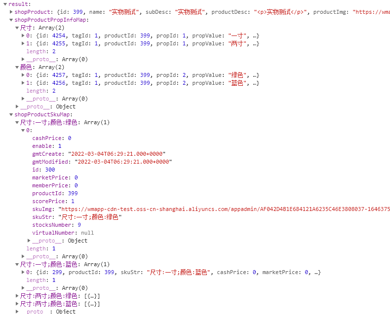

<!-- header -->
# 商品SKU优化

<!-- backgroundImage: "linear-gradient(to bottom, #67b8e3, #0288d1)" -->

---
<!-- paginate: true -->
### sku的学术概念
最小库存管理单元（Stock Keeping Unit, SKU）是一个会计学名词，定义为库存管理中的最小可用单元。

栗子：购买了一件男款，黑色，裤子

---
### 原商城部分问题
1. 品类固定，只有颜色和尺寸，不可扩展
2. 原有商品格式中中文拼接为key，选择属性后进行匹配时比较麻烦
3. 选完所有品类的属性，匹配到商品后才知道这个商品是否有库存，而不能在提前知道该属性是否可点击

---

---

### 思路

<!-- 1) 整理所有品类的可选属性

2) 拍平属性

3) 使用笛卡尔积计算sku

4) 判断属性是否可选（难点）。 -->

1. 将所有品类的所有属性整合
2. 拍平属性
3. 每个属性生成一个质数，对应这个属性
4. 根据品类，生成一个对应属性的质数的数组
5. 使用笛卡尔积计算sku
6. 筛选出可选的(有库存的)sku
7. 初始化展示内容
8. 获取当前可选属性

<!-- ---
### 判断属性是否可选
1. 遍历所有其他品类的所有属性，然后判断是否可选（无法处理已选个数不确定，且复杂度太高）
2. 拍平属性，然后给每个属性生成一个素数，然后每个可选路径均为素数乘积，通过
 -->

